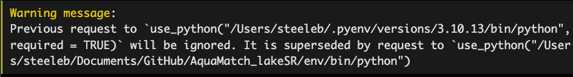

# Purpose

This script loads all necessary packages to run the {targets} pipeline for
AquaMatch_lakeSR then runs it! lakeSR extracts summaries of the Landsat
Collection 2 Surface Reflectance Product for the furthest point from shore
(polygon edge) for all lakes/reservoirs/ponds/impoundments in the United States
and Territories greater than 1ha and all waterbodies deemed "intermittent" by
the NHD greater than 4ha.

This R Markdown document is not meant to be "knit", rather to walk the user
through the process of setting up and running this workflow. Additional overview
about the {targets} workflow is available in the README file.

Anytime this workflow is run, you should start in a new R session, otherwise
some of the {reticulate} settings may not function correctly, leading to error
messages.

## Prerequsites

There are a number of packages required for this workflow. First, we install the
necessary packages using a `package_installer()` custom function.

Define package installer function

```{r package_installer}
package_installer <- function(x) {
  if (x %in% installed.packages()) {
    print(paste0("{", x ,"} package is already installed."))
    } else {
      install.packages(x, repos = "http://cran.us.r-project.org")
      print(paste0("{", x ,"} package has been installed."))
    }
  }
```

Check for packages required to run this workflow, install them if not already
present.

```{r walk_package_installer}
packages <- c("arrow",
              "bookdown",
              "cowplot",
              "crew",
              "data.table",
              "deming",
              "ggrepel",
              "ggthemes",
              "googledrive",
              "kableExtra",
              "nhdplusTools",
              "polylabelr",
              "reticulate",
              "rmapshaper",
              "sf",
              "tarchetypes",
              "targets",
              "tidyverse",
              "tigris",
              "tmap",
              "USA.state.boundaries",
              "viridis",
              "yaml")

# note we use base-r lapply and not map since tidy is not loaded (and possibly
# not installed) yet
lapply(packages, package_installer)

# this workflow requires the most up-to-date version of {nhdplusTools}
update.packages("nhdplusTools", repos = "http://cran.us.r-project.org")
```

## Completing the config.yml files

There are two configuration files for the lakeSR workflow. One is a general
configuration that controls the {targets} workflow (`config.yml`), the other is
a configuration for the GEE pull
(`b_pull_Landsat_SRST_poi/config_files/config_poi.yml`)

### General Workflow Configuration

Configuration of the `config.yml` file is necessary for this workflow to
function. For users outside of the ROSSyndicate, we recommend the 'default'
configuration, which uses cached data files in the ROSSyndicate Google Drive to
run the most time consuming portions of the workflow (namely, calculation of
waterbody centers and the run/collation of GEE files). Comments within the
`config.yml` file are present for guidance. Users can create custom
configurations as well, we provide the 'default' configuration as a starting
place for users. Before running this workflow it is important to confirm that
the desired `general_configuration` is set in the \_targets.R script on line 36.

### Google Earth Engine Configuration

The configuration file for GEE is only necessary if the general configuration
file argument `run_GEE: TRUE`. If this setting is set to `FALSE`, you do not
need to augment the GEE configuration file located at
`b_pull_Landsat_SRST_poi/config_files/config_poi.yml`.

If `run_GEE: TRUE`, you will need to modify the GEE configuration file in order
for this workflow to run successfully. The GEE configuration file is located at
`b_pull_Landsat_SRST_poi/config_files/config_poi.yml` and we also provide a
blank config file with default settings at the path
`b_pull_Landsat_SRST_poi/config_files/config.yml`. Comments are provided in
these files as guidance. In order for {targets} to use an updated config file,
you may need to change the file path on line 32 of the `_targets.R` script.

## Confirm Google Drive authorization

This workflow requires authentication of your Google account in order to access
Google Drive, irrelevant of whether you are running the Google Earth Engine
section or not. Use the code chunk below to confirm authentication of the
`google_email` listed in the general configuration file (as well as the GEE
configuration file, if `run_GEE: TRUE` in the general configuration).

```{r}
library(googledrive)

drive_auth()
```

## Confirm GEE access via API

In order to use the configuration `run_GEE: TRUE`, you must have a [Google Earth
Engine account](https://earthengine.google.com/signup/) and a configured [Google
Cloud Project](https://developers.google.com/earth-engine/cloud/projects). You
will also need to [download, install, and initialize
gcloud](https://cloud.google.com/sdk/docs/install). If you are running with the
configuration `run_GEE: FALSE` or as the default configuration, you can skip
this section.

After the above steps have been taken, create a virtual environment for this use
of Python, so that we can test that your Earth Engine connection is working
properly.

```{r}
if (!dir.exists("env")) {
  source("python/pySetup.R")
} else {
 reticulate::use_condaenv(condaenv = file.path(getwd(), "env"))
}
```

The final output of the previous cell will be "conda environment activated" in
your console if you have not run the python setup script before, or you may get
a warning similar to that below if you have previously run the python setup
script:



Now, we'll make sure that the Earth Engine API is set up correctly. Running this
code chunk will open a web browser if you have not used your account with GEE
before. Make sure that the credentials you use are the same that appear in your
GEE config file. When your browser will indicate that you have successfully
authenticated, return here to finish this step.

If the following python code chunk errors out with a "ModuleNotFoundError",
please restart your R session and re-run the previous code chunk before
re-running the following python chunk. If issues persist, you may need to delete
the 'env/' folder and repeat the above step again.

```{python}
import ee
import yaml

# note, you will need to update this file path if you are using a different config
# file
with open("b_pull_Landsat_SRST_poi/config_files/config_poi.yml") as config:
    try:
        cfg = yaml.safe_load(config)
    except yaml.YAMLError as exc:
        print(exc)

google = cfg["google_settings"]
ee_proj = next(item['ee_proj'] for item in google if 'ee_proj' in item)

ee.Authenticate(auth_mode="localhost")
ee.Initialize(project=ee_proj)

```

Executing ee.Initialize() should result in either no message or a message from
Google that does not contain WARNING or ERROR. If you receive a message with
WARNING or ERROR, go back and check your configuration file and be sure that the
email address and `ee_proj` exists and you have write permissions.

## Run the targets pipeline and output a network graph.

Warning: Running the complete workflow with the configuration setting
`run_GEE: TRUE` will take multiple days, mostly because of the bottleneck at
GEE: Only \~10 tasks are cued at any given time, and GEE determines how many
tasks are running at any given time (usually just 1-3 at any given time). For
local processes we use multiple cores, using {crew} worker integration with
{targets} wherever possible to increase efficiency. This workflow currently uses
n-1 cores as detected by the {parallel} package. However, GEE steps can not be
run using multi-core processes since the processing (and bottleneck) is not
local.

This code chunk will inform you of how many cores are available on your
computer:

```{r}
parallel::detectCores()
```

And this code chunk will run the pipeline:

```{r run_targets}
library(targets)

tar_make()
```

### Create a network diagram of the workflow.

```{r see_targets_net}
tar_visnetwork()
```
